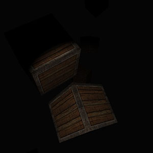

# [Learn OpenGL](https://learnopengl.com/) in Rust

This is a repository for my progress through the popular OpenGL tutorial *[Learn OpenGL](https://learnopengl.com/) by Joey de Vries* in Rust instead of C/C++.

I'm not gonna document every detail but I'll screenshot my progress and release little demos after major/interesting chapters :)

Crates in use:
- [gl](https://crates.io/crates/gl)
- [SDL2](https://crates.io/crates/sdl2)
- [rand](https://crates.io/crates/rand)
- [image](https://crates.io/crates/image)
- [fmath](https://github.com/smushy64/fmath)

Textures from the [Learn OpenGL github repo](https://github.com/JoeyDeVries/LearnOpenGL)

### [Demos](bin/releases/)

## Progress Images

### Spot Light

### Point Light

### Diffuse and Specular Mapping

