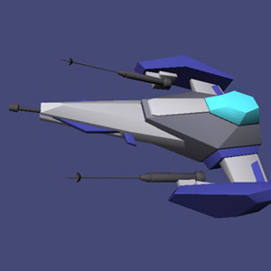

# [Learn OpenGL](https://learnopengl.com/) in Rust

This is a repository for my progress through the popular OpenGL tutorial *[Learn OpenGL](https://learnopengl.com/) by Joey de Vries* written in Rust instead of C/C++.

I'm not gonna document every detail but I'll screenshot my progress and release little demos after major/interesting chapters :)

Crates in use:
- [gl](https://crates.io/crates/gl)
- [SDL2](https://crates.io/crates/sdl2)
- [image](https://crates.io/crates/image)
- [colored](https://crates.io/crates/colored)
- [fmath](https://github.com/smushy64/fmath)
- [wavefront_obj](https://github.com/smushy64/rs_wavefront_obj_parser)

### [Demos](bin/releases/)

## Progress Images

### Transparency and Blending | [Demo](bin/releases/transparency_blending/)

### Stencil and Depth Buffer | [Demo](bin/releases/stencil_depth/)

### Advanced Mesh Loading | [Demo](bin/releases/advanced_mesh_loading/)

