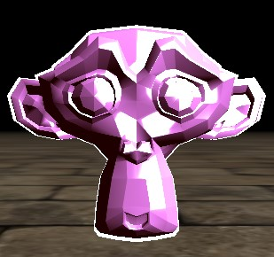

## Stencil and Depth Buffer Demo

Download and unzip, run `opengl.exe`.

The program will not run without the resources folder present in the same directory.

Suzanne model by the [Blender Foundation](https://www.blender.org/)

## Controls
| Key            | Action                |
|----------------|-----------------------|
| WASD           | Lateral Movement      |
| Space & LCtrl  | Vertical Movement     |
| L Shift        | Increase Camera Speed |
| Mouse          | Look                  |
| ESC            | Quit Application      |

